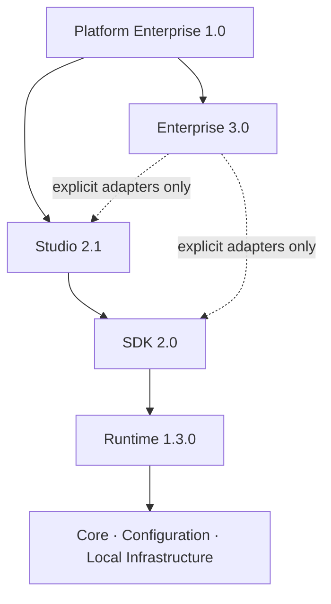

# TKAI Platform 1.0 Architecture

Platform Enterprise 1.0 documents the stable composition of Runtime 1.3.0, SDK
2.0, Studio 2.1, and Enterprise 3.0 reference foundations. Dependencies flow
downward: Studio consumes public SDK contracts; SDK adapters compose Runtime
capabilities; Runtime owns core and optional infrastructure foundations.
Enterprise remains explicit and never creates a reverse dependency.



Studio's frozen REST contract is an independent product boundary. Runtime stays
backward compatible whether SDK, Studio, or Enterprise are present or not. See
[Platform.md](Platform.md) for release/version mapping and [Studio.md](Studio.md)
for Studio-specific boundaries.

## Enterprise reference foundations

Enterprise 3.0 packages offline contracts for identity, organization, tenant,
authorization, audit, and licensing. These are reference foundations only:
they have no authentication flow, storage, enforcement, cloud dependency, or
automatic Runtime/SDK/Studio integration. See [Enterprise.md](Enterprise.md).

## TKAI 2.0 Developer Platform

The additive `tkai.sdk` package provides declarative developer interfaces above
the V1.x Runtime. See [SDK architecture](SDK.md). It does not modify or replace
the established Runtime, ProviderManager, workflow engine, or backend defaults.

TKAI is organized as independent layers with one-way dependencies: commands
call generators, templates, configuration, and framework services; framework
services depend only on `tkai.core`. This prevents command/UI imports from
forming runtime cycles with domain services.

```text
commands → generators/templates/config → core
plugins, workflow, ai                → core
```

The workflow layer depends only on core exceptions and typed local models.
Its executor owns retry and timeout mechanics, while the scheduler retains the
compatible serial/parallel facade. This keeps workflows independent of plugins
and provider implementations.

The public package APIs are exposed from each package's `__init__.py`; legacy
paths such as `tkai.template_engine.TemplateManager` remain compatibility
imports for the canonical template manager.

## Workflow runtime

`WorkflowEngine` is a public facade. `WorkflowRuntime` owns execution state,
`Dispatcher` owns stable dependency-ready queues, `Executor` owns a single
step invocation, and `CheckpointManager` serializes runtime state. The CLI
only invokes the facade and does not import scheduler internals, avoiding a
reverse dependency from commands into runtime control.

## AI providers

The AI layer is independent of workflow runtime internals. `ProviderManager`
routes normalized requests to provider adapters; adapters return TKAI models,
not third-party SDK objects. Optional SDKs are lazy imports.

The provider subsystem has one-way internal dependencies:

```text
tkai ai CLI → AICommandService → DoctorService / ProviderManager / FallbackEngine
ProviderManager → ProviderRegistry → AIProvider
OpenAI-compatible provider → RuntimeAdapter → ProviderRuntime → AsyncTransport
```

Capability routing lives in `ProviderManager` and consumes typed capability
declarations held by `ProviderRegistry`; it does not depend on fallback.
`FallbackEngine` consumes an already ordered, capability-filtered candidate
list and has no dependency on the manager. `DoctorService` is read-only and
inspects these layers without sending requests or changing lifecycle state.
This separation keeps command imports from reversing runtime dependencies.
# TKAI V5 Production Architecture

V5 retains the layered architecture and adds a canonical static TikTok registry
at `tiktok/registry.py`. The API composes completed TikTok services in dependency
order; readiness and runtime health consume the same registry. Startup and
shutdown ownership remains in the bounded Windows local-runtime layer. See
[V5 Modules](V5Modules.md).
