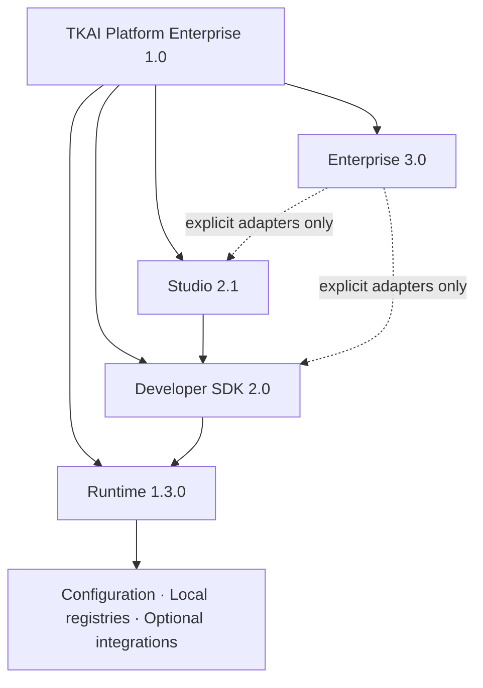

# TKAI Platform 1.0

TKAI Platform Enterprise 1.0 is the supported composition of the stable
Runtime, additive Developer SDK, independent Studio product layer, and
Enterprise reference foundations.

| Layer | Release | Responsibility |
|---|---:|---|
| Platform | 1.0.0 | Release baseline, documentation, and operational guidance |
| Runtime | 1.3.0 | Core workflows, providers, configuration, and infrastructure foundations |
| SDK | 2.0 | Explicit Agent, Workflow, Tool, Provider, Memory, and Plugin contracts |
| Studio | 2.1 | Optional product layer above the SDK, with frozen local REST contracts |
| Enterprise | 3.0 | Additive identity, organization, tenant, authorization, audit, and license reference contracts |

Platform 1.0 does not introduce a second Python distribution version. The
published `tkai` package version remains `1.3.0`; SDK, Studio, and Enterprise
version labels describe their supported platform layers.

## Layering

Studio calls only public SDK boundaries. The SDK composes explicit adapters on
top of Runtime capabilities. Runtime remains backward compatible and does not
require SDK, Studio, or Enterprise to be enabled. Enterprise reference services
do not install authentication, authorization enforcement, persistence, or
middleware by default.

## Guides

- [Architecture overview](Architecture.md)
- [Installation](Installation.md)
- [Developer guide](DeveloperGuide.md)
- [Administrator guide](AdministratorGuide.md)
- [Operations guide](OperationsGuide.md)
- [Release notes](ReleaseNotes.md)
- [Release checklist](ReleaseChecklist.md)
- [Enterprise architecture](Enterprise.md)
- [Enterprise GA preparation](release/platform-enterprise-1.0.md)
- [Roadmap](Roadmap.md)
