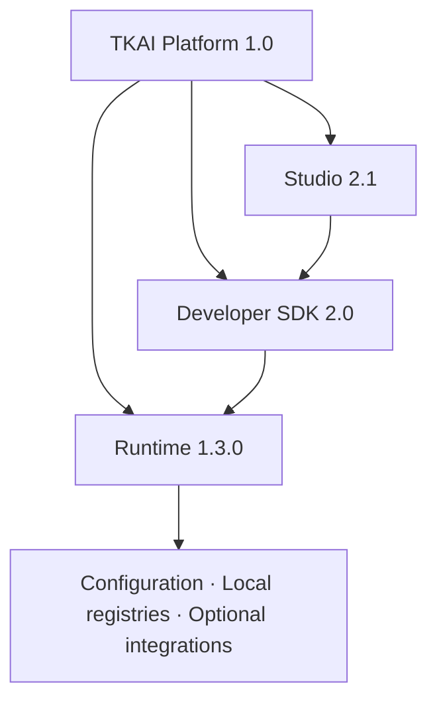

# TKAI Platform 1.0

TKAI Platform 1.0 is the supported composition of the stable Runtime, additive
Developer SDK, and independent Studio product layer.

| Layer | Release | Responsibility |
|---|---:|---|
| Platform | 1.0.0 | Release baseline, documentation, and operational guidance |
| Runtime | 1.3.0 | Core workflows, providers, configuration, and infrastructure foundations |
| SDK | 2.0 | Explicit Agent, Workflow, Tool, Provider, Memory, and Plugin contracts |
| Studio | 2.1 | Optional product layer above the SDK, with frozen local REST contracts |

Platform 1.0 does not introduce a second Python distribution version. The
published `tkai` package version remains `1.3.0`; SDK and Studio version labels
describe their supported platform layers.

## Layering

Studio calls only public SDK boundaries. The SDK composes explicit adapters on
top of Runtime capabilities. Runtime remains backward compatible and does not
require SDK or Studio to be enabled.

## Guides

- [Architecture overview](Architecture.md)
- [Installation](Installation.md)
- [Developer guide](DeveloperGuide.md)
- [Administrator guide](AdministratorGuide.md)
- [Operations guide](OperationsGuide.md)
- [Release notes](ReleaseNotes.md)
- [Release checklist](ReleaseChecklist.md)
- [Roadmap](Roadmap.md)
